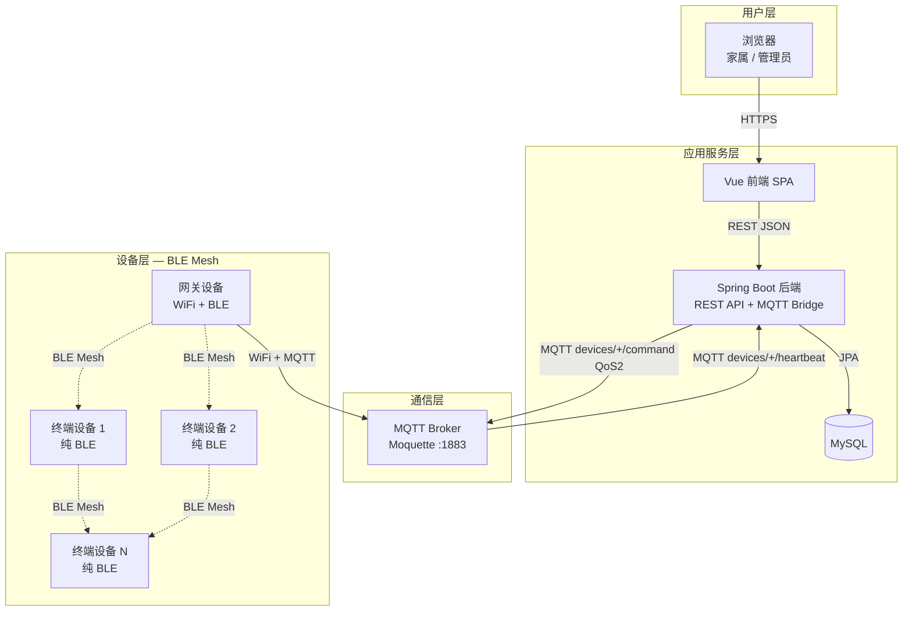
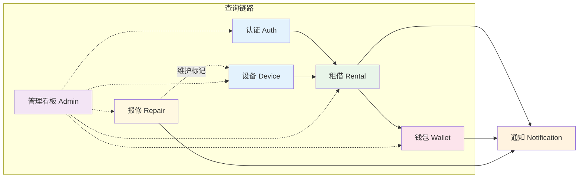
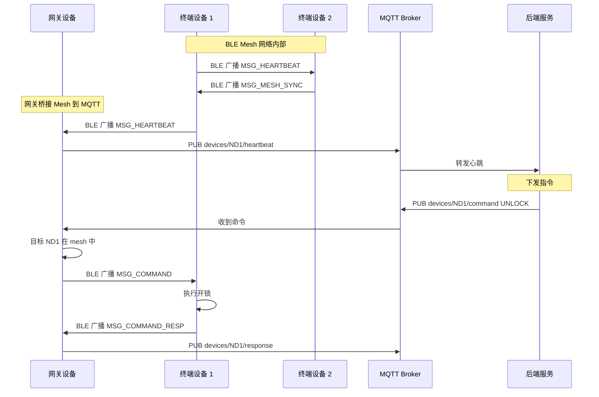
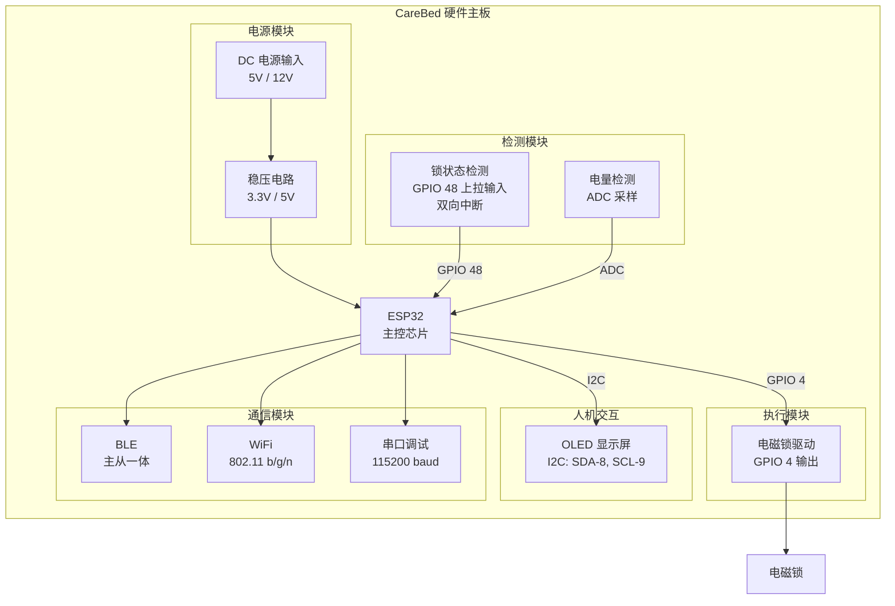

# CareBed Platform — 物联网共享陪护床系统

> **面向医院场景的共享陪护床软硬件一体化解决方案**  
> 项目状态：v0.1 | 技术栈：Spring Boot 3 + Vue 3 + ESP32 + BLE Mesh + MQTT + MySQL

---

*图1 系统标识*

---

## 目录

- [1. 项目背景](#1-项目背景)
- [2. 系统整体架构](#2-系统整体架构)
- [3. 硬件整体介绍](#3-硬件整体介绍)
- [4. 软件架构设计](#4-软件架构设计)
- [5. 性能指标](#5-性能指标)
- [6. 设计流程](#6-设计流程)
- [7. 总结与展望](#7-总结与展望)

---

## 1. 项目背景

随着我国人口老龄化进程加快，住院陪护需求日益增长。医院传统的陪护床租赁管理方式存在流程繁琐、设备监管困难、计费不透明等痛点。本系统针对上述问题，基于物联网技术，构建了一套涵盖**硬件终端（ESP32 智能锁控）、云服务端（Spring Boot）、前端管理面板（Vue）**的完整闭环方案，实现了陪护床从注册、租借、计费、归还到维修的全链路智能化管理。

---

## 2. 系统整体架构

### 2.1 系统总体框图

*图2 系统总体框图*

### 2.2 系统说明

系统采用四层架构设计：

1. **设备层（BLE Mesh 网络）**：每张陪护床内置 ESP32 微控制器，集成了 BLE 主从一体通信、电磁锁控制和 OLED 显示。所有设备通过 BLE 构建 mesh 网络——每个设备既是广播者也是接收者，能自主发现邻居设备并建立双向连接。其中至少一台设备具备 WiFi 连接能力（网关节点），负责 mesh 网络与云端的桥接。

2. **通信层（消息路由）**：采用双层通信机制。Mesh 内部基于 BLE GATT 协议——设备间通过自定义 Service/Characteristic 交换 JSON 消息，每条消息携带唯一 msgId 和 TTL，通过 LRU 去重确保无环转发。设备与云端之间通过 MQTT 协议——网关节点订阅 mesh 中所有设备的命令主题，代理非网关设备上下行消息。

3. **应用服务层（业务逻辑）**：Spring Boot 3 后端封装完整业务能力，包含认证鉴权、设备管理、租借计费、钱包交易、报修维修、通知推送、管理看板等七大模块，通过 JPA 实现 MySQL 持久化，通过 Paho MQTT 桥接完成与设备的双向通信。

4. **用户层（交互界面）**：Vue 3 SPA 提供家属端与管理端双门户，通过 REST API 与后端交互，覆盖租借操作、设备监控、数据分析等场景。

### 2.3 各模块关系

*图3 模块关系图*

### 2.4 Mesh 通信模式

*图4 Mesh 通信序列图*

---

## 3. 硬件整体介绍

### 3.1 硬件架构总览

硬件系统以 ESP32 为核心控制器，外围电路包括电磁锁驱动模块、OLED 显示模块、电源管理模块及状态检测模块。各模块之间通过 GPIO、I2C 等接口互联。

*图5 硬件架构框图*

### 3.2 电路各模块设计

#### 3.2.1 主控模块（ESP32）

采用 ESP32 DevKit 系列模组，内置 Tensilica Xtensa LX6 双核处理器，主频 240 MHz，集成 520 KB SRAM 和 4 MB Flash，支持 802.11 b/g/n WiFi 和蓝牙双模通信。作为系统核心，负责 BLE Mesh 协议栈运行、锁控逻辑执行、OLED 显示驱动及外设管理。

**关键引脚说明：**

| 引脚 | 功能 | 信号方向 |
|------|------|----------|
| GPIO 4  | 电磁锁继电器控制 | 输出 |
| GPIO 48 | 锁状态反馈（上拉输入，双向中断） | 输入 |
| GPIO 8 (SDA) | OLED I2C 数据线 | 双向 |
| GPIO 9 (SCL) | OLED I2C 时钟线 | 输出 |

> **\[此处插入 SCH 原理图 -- 主控模块部分\]**  
> *图6 主控模块原理图（标注 ESP32 最小系统电路及关键 I/O 信号线）*

#### 3.2.2 电磁锁驱动模块

电磁锁通过继电器与 ESP32 GPIO 4 连接。控制逻辑如下：

- **开锁操作**：GPIO 4 输出高电平脉冲（脉宽 500 ms），驱动继电器线圈吸合，电磁锁断电释放。
- **开锁失败重试**：支持最多 3 次自动重试，重试间隔 300 ms。
- **锁状态验证**：通过 GPIO 48 读取锁状态反馈信号（上拉输入，双向中断），高电平表示开锁，低电平表示闭锁。

| 信号 | 来源 | 目标 | 说明 |
|------|------|------|------|
| LOCK_CTRL | ESP32 GPIO 4 | 继电器 IN | 高电平脉冲驱动开锁 |
| LOCK_STATE | 锁反馈 | ESP32 GPIO 48 | 读取锁实际状态（上拉输入，双向中断） |

> **\[此处插入 SCH 原理图 -- 继电器驱动电路\]**  
> *图7 电磁锁驱动模块原理图（标注 LOCK_CTRL 控制信号与 LOCK_STATE 反馈信号）*

#### 3.2.3 OLED 显示模块

采用 0.96 寸 SSD1306 OLED 显示屏（128x64 像素），通过 I2C 总线与 ESP32 通信。固件中集成 U8g2 图形库，实时显示设备编号、BLE Mesh 连接状态、WiFi 连接状态、当前时间及开锁确认信息。

| 信号 | 来源 | 目标 | 说明 |
|------|------|------|------|
| SDA | ESP32 GPIO 8 | OLED SDA | I2C 数据 |
| SCL | ESP32 GPIO 9 | OLED SCL | I2C 时钟 |

> **\[此处插入 SCH 原理图 -- OLED 显示模块\]**  
> *图8 OLED 显示模块原理图（标注 I2C 总线连接）*

#### 3.2.4 电源模块

系统支持外部 DC 5V/12V 供电，通过稳压电路转换为 3.3V 为 ESP32 及外设供电，5V 为继电器线圈供电。

> **\[此处插入 SCH 原理图 -- 电源模块\]**  
> *图9 电源模块原理图（标注电压转换路径）*

#### 3.2.5 PCB 版图

> **\[此处插入 PCB 版图 -- 正面\]**  
> *图10 PCB 正面布局图（标注各模块位置）*

> **\[此处插入 PCB 版图 -- 背面\]**  
> *图11 PCB 背面布局图*

#### 3.2.6 硬件物料清单（BOM）

> **\[此处插入 BOM 表截图\]**  
> *图12 核心物料清单（参见 Hardware/工程文件/BOM_Board1_Schematic1.csv）*

---

## 4. 软件架构设计

### 4.1 技术栈

| 层级 | 技术选型 | 版本 |
|------|----------|------|
| 后端语言 | Java | 21 |
| 后端框架 | Spring Boot | 3.2.5 |
| 数据库 | MySQL + JPA (Hibernate) | 8.0+ |
| MQTT Broker | Moquette (嵌入式) | 0.17 |
| MQTT 客户端 | Eclipse Paho | 1.2.5 |
| 前端框架 | Vue 3 (CDN + Pico CSS) | 3.x |
| 设备固件 | Arduino framework + BLEDevice + PubSubClient | ESP32 |
| 构建工具 | Maven | -- |
| 安全认证 | 自定义 Token (UUID) + BCrypt | -- |

### 4.2 后端模块架构

系统后端包含 103 个 Java 类，划分为以下核心模块：

#### 4.2.1 认证模块（Auth）

- **注册/登录**：支持家属（FAMILY）和管理员（ADMIN）双角色注册，密码经 BCrypt 加密存储。
- **会话管理**：登录后生成 UUID Token，存入 `user_sessions` 表，有效期 12 小时。
- **患者关联**：家属用户可关联患者住院号，与租借流程联动。

#### 4.2.2 设备管理模块（Device）

- **设备生命周期**：注册到可用（AVAILABLE）到使用中（IN_USE）到维护（MAINTENANCE）到离线（OFFLINE）。
- **在线状态机**：由心跳驱动，`onlineStatus` 在 ONLINE/OFFLINE 之间切换；90 秒无心跳自动标记离线。
- **MQTT 桥接**（`DeviceMqttBridge`）：实现 `DeviceCommandGateway` 接口，支持远程开锁（UNLOCK）和重启（REBOOT）指令下发。

#### 4.2.3 租借计费模块（Rental）

- **租借流程**：开始租借、设备绑定患者、定时计费、归还确认关锁、扣费、释放设备。
- **计费规则**：10 元/小时（`HOURLY_RATE`），按使用时长结算。
- **超时检测**：定时任务扫描 `expectedEndAt` 已过期的订单，自动标记为 OVERDUE。

#### 4.2.4 钱包模块（Wallet）

- **账户体系**：每位用户自动创建钱包账户，支持充值、扣费、退款。
- **交易记录**：每一笔操作生成 `WalletTransaction`，类型包括 RECHARGE、DEBIT、REFUND、ADJUSTMENT。
- **争议处理**：用户可就订单发起争议申诉，管理员审核后处理。

#### 4.2.5 通知模块（Notification）

- **通知类型**：7 种枚举类型，覆盖租借成功、超时提醒、扣费通知、报修更新等。
- **双渠道**：同时通知当事用户和管理员通道（ID 为全零 UUID）。

#### 4.2.6 报修维修模块（Repair）

- **工单流程**：创建（OPEN）到处理中（IN_PROGRESS）到解决（RESOLVED）或驳回（REJECTED）。
- **设备联动**：报修提交后关联设备自动进入 MAINTENANCE 状态。

#### 4.2.7 管理后台模块（Admin）

- **概览面板**：16 项统计指标（用户数、设备数、租借数、维修数、收入、余额等）。
- **趋势分析**：按日统计使用量和收入趋势。

### 4.3 BLE Mesh 通信协议

#### 4.3.1 Mesh 消息格式

每条 mesh 消息为 JSON 格式，包含以下字段：

| 字段 | 含义 | 说明 |
|------|------|------|
| `i` | 消息 ID | `{deviceCode}-{timestamp}-{seq}`，全局唯一 |
| `t` | 消息类型 | 整型，详见消息类型枚举 |
| `s` | 源设备编号 | 发送者的 deviceCode |
| `d` | 目标设备编号 | 仅 MSG_COMMAND 使用 |
| `h` | TTL | 初始值 5，每转发一次减 1，0 时丢弃 |
| `p` | 载荷 | 嵌套 JSON，内容因消息类型而异 |

#### 4.3.2 消息类型枚举

| 类型值 | 名称 | 用途 |
|--------|------|------|
| 1 | MSG_HEARTBEAT | 设备心跳，所有设备每 10 秒广播一次到 mesh |
| 2 | MSG_COMMAND | 远程指令，来自 MQTT，经网关转发到 mesh |
| 3 | MSG_COMMAND_RESP | 指令执行结果，发回网关 |
| 5 | MSG_MESH_SYNC | 拓扑同步，每 30 秒广播一次 |
| 6 | MSG_MESH_JOIN | 设备加入通知 |
| 7 | MSG_MESH_LEAVE | 设备离开通知 |

#### 4.3.3 防泛洪转发机制

每条消息的 `i`（msgId）由源设备唯一生成。每个节点维护一个 128 条目的 LRU 缓存，检测到重复 msgId 时直接丢弃，从根源上杜绝了消息环路导致的广播风暴。TTL 字段每转发一次减 1，到达 0 后不再转发，进一步限制了消息的传播范围。

### 4.4 MQTT 通信协议

| 方向 | 主题 | QoS | 载荷格式 | 说明 |
|------|------|-----|----------|------|
| 上行 | `devices/{code}/heartbeat` | 1 | `{"battery":85,"lockStatus":"LOCKED"}` | 设备心跳 |
| 下行 | `devices/{code}/command` | 2 | `{"command":"UNLOCK","issuedAt":"...","commandId":"..."}` | 远程控制指令 |
| 上行 | `devices/{code}/response` | 0 | `{"command":"UNLOCK","result":"SUCCESS"}` | 指令执行结果 |

### 4.5 数据库设计

系统共包含以下数据表：

| 表名 | 用途 | 核心字段 |
|------|------|----------|
| `user_accounts` | 用户账户 | id, username, passwordHash, role, fullName, phone, linkedPatientId |
| `user_sessions` | 登录会话 | token, userId, issuedAt, expiresAt |
| `devices` | 设备信息 | id, deviceCode, ward, bedNumber, status, batteryLevel, onlineStatus, lockStatus, lastHeartbeat |
| `device_events` | 设备事件日志 | id, deviceId, type, description, createdAt |
| `rental_records` | 租借记录 | id, userId, deviceId, deviceCode, startedAt, endedAt, status, amount |
| `wallet_accounts` | 钱包账户 | userId, balance, updatedAt |
| `wallet_transactions` | 钱包交易记录 | id, userId, type, amount, reference, orderId |
| `wallet_disputes` | 争议申诉 | id, userId, orderId, reason, status, resolution |
| `repair_tickets` | 报修工单 | id, userId, deviceId, description, status, resolution |
| `notification_messages` | 通知消息 | id, recipientId, type, title, content, isRead |
| `mqtt_logs` | MQTT 通信日志 | id, direction, topic, payload, deviceCode |
| `activity_logs` | 操作审计日志 | id, actorId, actorName, action, details |

### 4.6 REST API 端点汇总

| 端点 | 方法 | 模块 |
|------|------|------|
| `/api/auth/register` | POST | 认证 |
| `/api/auth/login` | POST | 认证 |
| `/api/devices` | GET/POST | 设备 |
| `/api/devices/{id}/unlock` | POST | 设备/MQTT |
| `/api/rentals/start` | POST | 租借 |
| `/api/rentals/{id}/return` | POST | 租借 |
| `/api/wallet/recharge` | POST | 钱包 |
| `/api/repairs` | GET/POST | 报修 |
| `/api/messages` | GET | 通知 |
| `/api/admin/overview` | GET | 管理看板 |
| `/api/admin/analytics` | GET | 数据分析 |
| `/api/mqtt-logs` | GET | MQTT 日志 |

完整 API 参考详见 `Software/SpringBoot/README.md`。

---

## 5. 性能指标

| 指标项 | 设计值 | 说明 |
|--------|--------|------|
| BLE Mesh 心跳间隔 | 10 s | 所有设备通过 BLE 广播心跳到 mesh |
| BLE 扫描周期 | 4 s 扫描 / 20 s 冷却 | 避免持续扫描耗电 |
| Mesh 消息 TTL | 5 跳 | 超过 5 跳的消息自动丢弃 |
| 消息去重缓存 | 128 条 LRU | 防泛洪环路 |
| Peer 超时阈值 | 120 s | 超时后移除 peer 列表 |
| 心跳超时阈值 | 90 s | 后端检测设备离线 |
| 开锁响应延迟 | 小于等于 2 s | 从指令下达到锁状态更新 |
| 并发连接数 | 小于等于 6 个 BLE peer | ESP32 BLE 硬件限制 |
| 会话有效期 | 12 h | Token 自动过期 |
| 租借计费精度 | 分（0.01 元） | BigDecimal 精确运算 |

---

## 6. 设计流程

本系统采用迭代式开发流程，分为四个阶段：**需求分析**阶段完成业务流程梳理与用例建模，产出需求文档与流程图；**系统设计**阶段确定四层架构（设备层-BLE Mesh、通信层-MQTT）、数据库 ER 设计与 BLE Mesh 协议定义；**实现开发**阶段并行推进硬件固件与软件平台开发，使用 BLE 调试工具与模拟设备进行单元测试与集成联调；**部署验证**阶段将后端部署至生产服务器，使用 MQTTX、nRF Connect 等工具验证 BLE Mesh 链路与 MQTT 桥接，完成端到端业务流程验收。

> **\[此处插入需求分析流程图 and 业务用例图\]**  
> *图13 需求分析阶段产出物（参见 docs/Order/ 目录）*

---

## 7. 总结与展望

本文详细阐述了物联网共享陪护床系统的全栈设计方案。系统以 ESP32 为硬件终端，通过 BLE Mesh 实现设备间自组织网络，配合 MQTT 桥接与云端的 Spring Boot 3 后端，实现了陪护床从设备注册、在线租借、自动计费到归还维修的完整闭环。系统具备**去中心化的 BLE Mesh 组网**（无需全部设备联网）、**低延迟指令响应**（开锁不超过 2s）、**防泛洪消息转发**（msgId + TTL + LRU 三重保护）和**完备的支付争议处理**能力。

**未来规划：**

- **多租户架构**：引入医院/科室维度，支持跨院区独立运营；
- **计费策略扩展**：支持按次、按天、阶梯价格、优惠券等多种模式；
- **消息多渠道**：集成微信公众号、短信等通知渠道；
- **数据分析大屏**：实时展示设备热力图、使用趋势、收入看板；
- **固件 OTA**：支持设备固件远程升级；
- **边缘计算**：在 ESP32 端侧运行轻量规则引擎，降低云端依赖；
- **Mesh 路由优化**：引入动态路由选择，减少非必要转发。

---

*文档版本：v2.0（BLE Mesh） | 最后更新：2026-07-08*  
*项目仓库：[Software/SpringBoot/](Software/SpringBoot/) | [Software/Vue/](Software/Vue/) | [Frimware/](Frimware/) | [Hardware/](Hardware/) | [docs/](docs/)*
