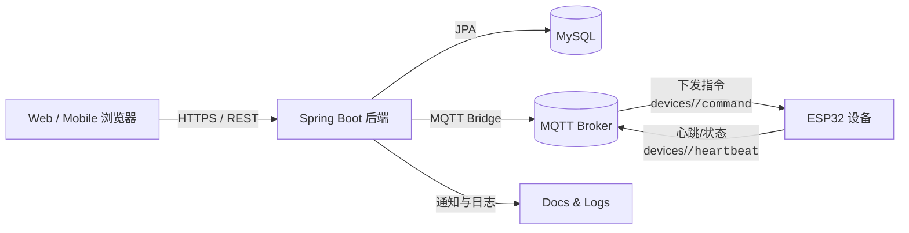
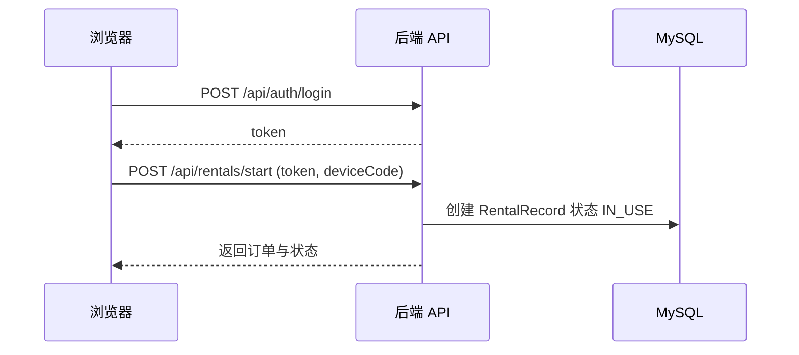
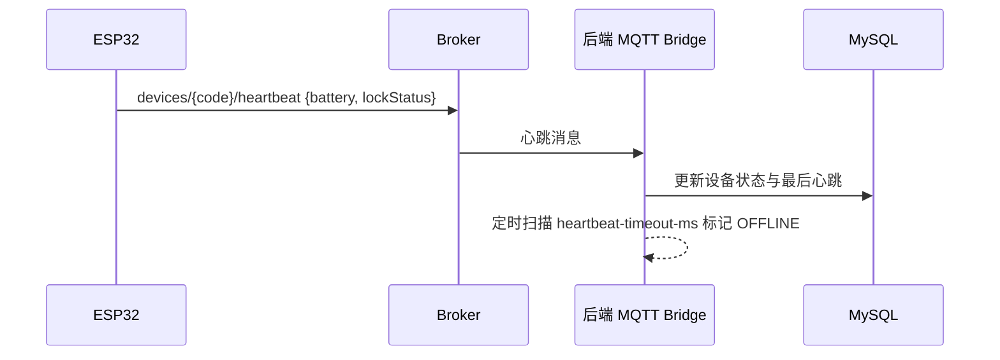
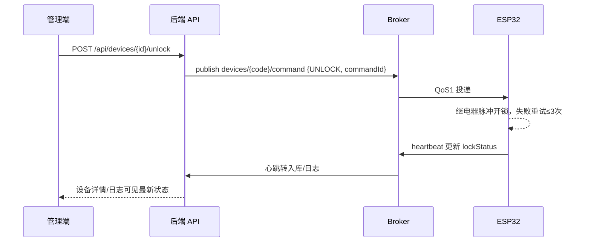

# CareBed 平台总览

面向医院共享陪护床业务的软硬件一体方案，包含设备端硬件、固件、Spring Boot 后端、Vue 前端演示与运维资料。本文提供全局导航、架构与流程图、仓库目录与快速上手。

## 快捷跳转

- [架构总览](#架构总览)
- [仓库目录](#仓库目录)
- [快速开始](#快速开始)
- [配置速查](#关键配置速查)
- [联调清单](#联调与测试清单)
- 项目架构
  - 后端 [Software/SpringBoot/README.md](Software/SpringBoot/README.md)
  - 前端 [Software/Vue/README.md](Software/Vue/README.md)
  - 固件 [Frimware/README.md](Frimware/README.md)
  - 运维文档 [docs/](docs)

## 架构总览



## 仓库目录

```
Carebed Platform
├─ Docs/                      # 部署、MQTT 联调、数据库迁移等文档
│  ├─ mqtt-integration.md
│  ├─ mqttx-testing.md
│  ├─ mysql-migration.md
│  ├─ Order/
│  ├─ Image/
│  └─ server-deployment.md
├─ Frimware/                  # ESP32 固件示例与说明
│  ├─ esp32-mqtt-reference.ino
│  └─ README.md
├─ Hardware/                  # 结构/生产相关文件
│  ├─ 工程文件/
│  └─ 生产文件/
├─ Software/                  # 软件源码
│  ├─ SpringBoot/             # 后端服务（Java 21 + Spring Boot 3）
│  └─ Vue/                    # 前端演示（静态 Vue 3）
└─ .vscode/                   # 开发环境配置
```

## 端到端流程图

### 1. 登录与租借



### 2. 设备心跳与离线检测



### 3. 远程开锁指令



## 快速开始

1. 环境：JDK 21、Maven、MySQL 8、可访问的 MQTT Broker；前端可选 Node.js（本地静态服务），设备端使用 Arduino IDE。
2. 后端：按 [Software/SpringBoot/README.md](Software/SpringBoot/README.md) 配置 `application.yml` 的数据源与 MQTT，执行 `mvn spring-boot:run`，默认端口 8081。
3. 前端：进入 [Software/Vue](Software/Vue)，`npx serve .` 或 `python -m http.server 5173` 后访问；如需改后端地址，修改 `index.html` 顶部 `apiBase`。
4. 设备：刷写 [Frimware/esp32-mqtt-reference.ino](Frimware/esp32-mqtt-reference.ino)，串口用 `SET WIFI` / `SET ID` 配置联网与设备编号，确保连到同一 MQTT Broker。

## 关键配置速查

- 后端端口：`server.port`（默认 8081）。
- 数据源：`spring.datasource.url/username/password`，启动执行 `schema.sql` 且 `ddl-auto: update` 同步结构。
- MQTT：
  - `carebed.mqtt.enabled` 开关 MQTT 桥接。
  - `carebed.mqtt.bridge.host/port` 指向 Broker；默认主题 `devices/{deviceCode}/heartbeat` 与 `devices/{deviceCode}/command`。
  - `heartbeat-timeout-ms`、`offline-check-interval-ms` 控制离线判定节奏。
- 前端：`index.html` 顶部 `apiBase`。
- 设备：源码顶部 `MQTT_HOST/MQTT_PORT`，串口命令可更新 WiFi 与设备编号。

## 联调与测试清单

- 后端健康：`/api/auth/login`、`/api/devices` 返回正常；`mvn test` 通过。
- MQTT 联通：设备心跳在 Broker 可见，后端日志显示入库；下发指令能被设备消费并回报心跳。
- 前端演示：完成登录、租借、归还、通知查看的全链路操作。
- 设备动作：串口日志能看到开锁尝试与心跳；断网后心跳超时会被后端标记 OFFLINE。

## 推荐阅读

- 部署与运维：[docs/server-deployment.md](docs/server-deployment.md)
- MQTT 联调：[docs/mqtt-integration.md](docs/mqtt-integration.md)
- MySQL 迁移说明：[docs/mysql-migration.md](docs/mysql-migration.md)
- MQTTX 测试示例：[docs/mqttx-testing.md](docs/mqttx-testing.md)
